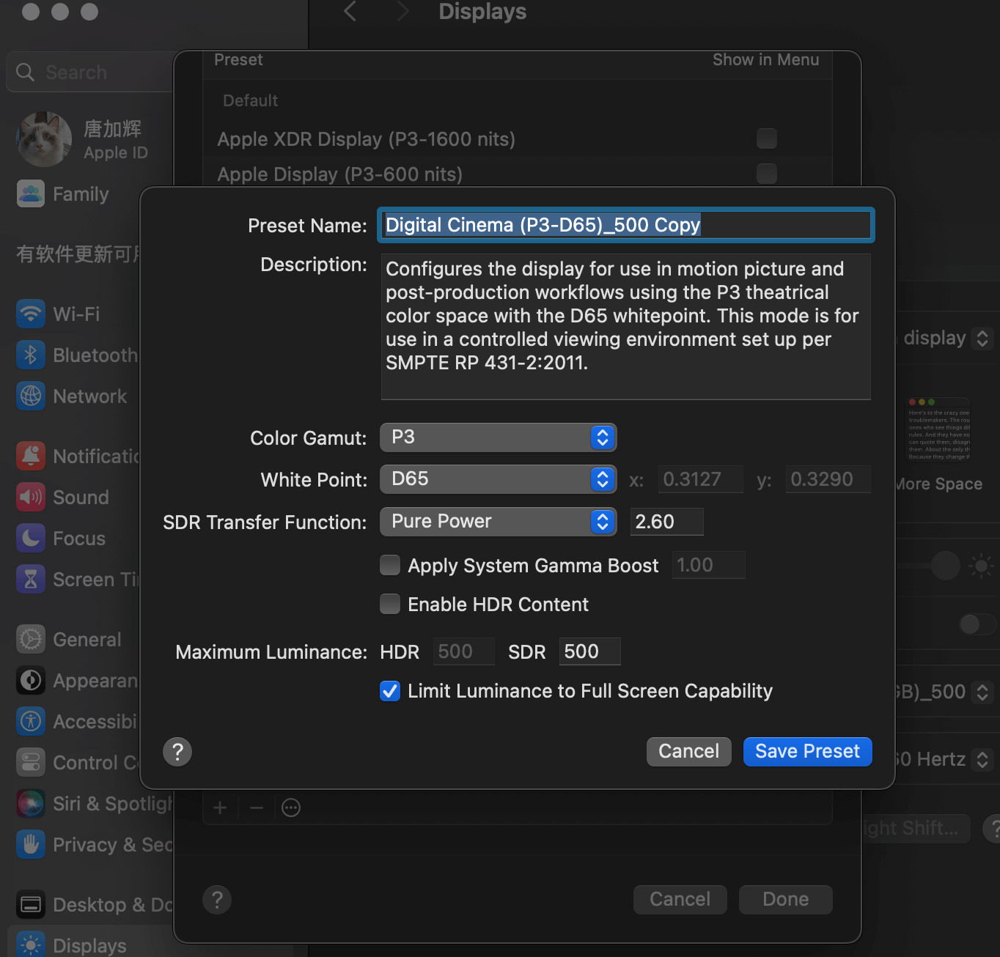
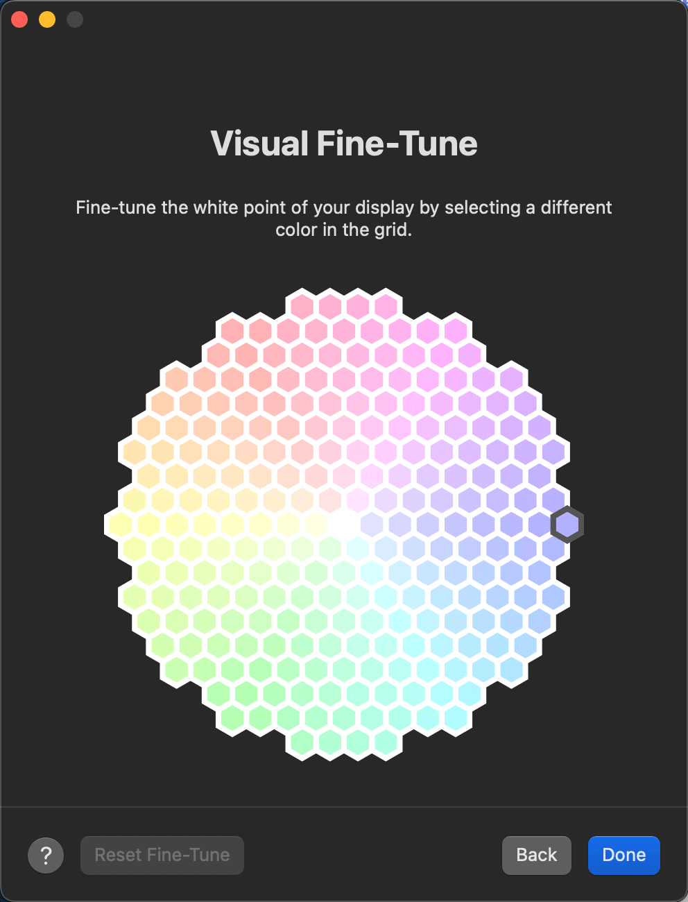
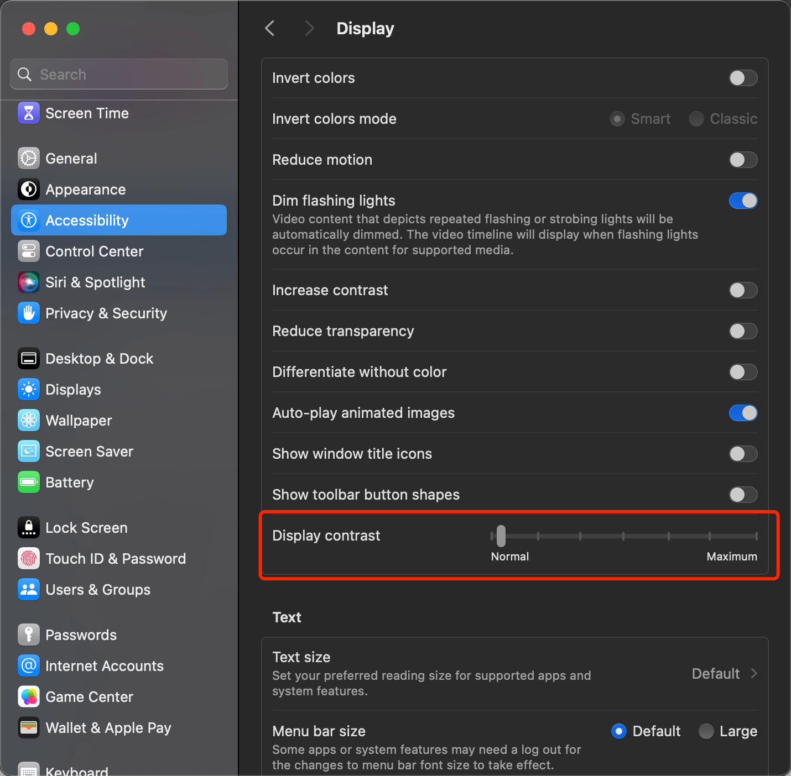
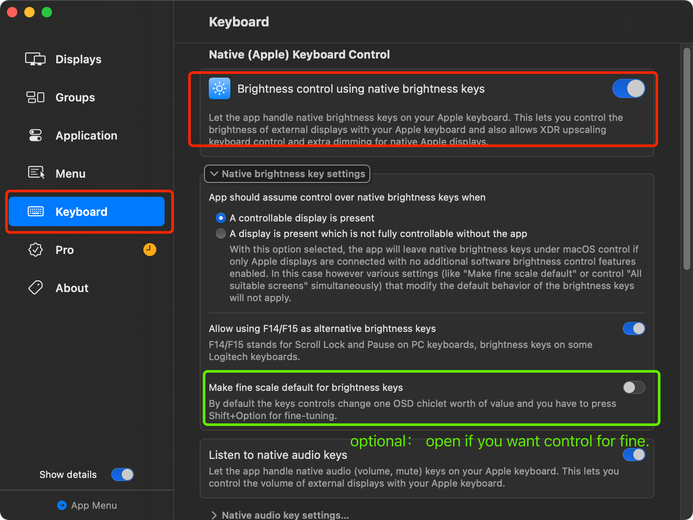
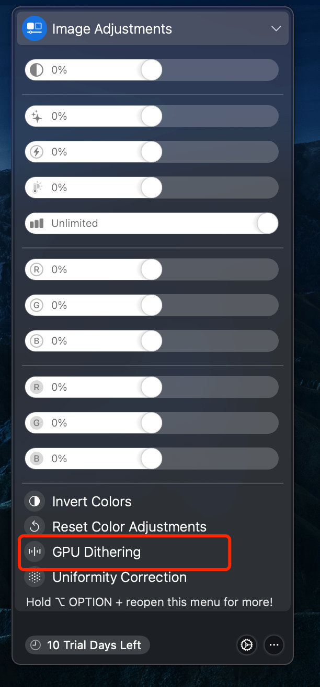

# Resolve MBP 14/16 Mini-Led Yellow And glaring Screen

[中文](../解决mbp16的miniled屏幕刺眼发黄问题/README.md)&emsp;en_US
## 1. Adjust Color and max-height
open `setting`, choose `Displays`, change `Refresh Rate` to `60`. Then click `Preset`, select `Customize Presets`, click the `+` at the bottom left. make the settings like the image below.

## 2. Calibrate Display

open: `settings` -> `Displays` -> `Preset` -> `Calibrate Display`, and click `Visual Fine-Tune`， choose the white point like the image below.

## 3. Resolve screen graying

open: `Accessibility` -> `Display`, change the `Display contrast` like blow.

> tips: The closer the slider is to the left end, the brighter the image and the clearer the black background text. It depends on which visual style you prefer.

## 4. Support Control Brightness by Keyboard

Download [BetterDisplay](https://github.com/waydabber/BetterDisplay/releases) ，then open。

press `command ,` to open the setting page, select the `Keyboard` on the left, open the `Brightness control using native brightness keys` on the right.

> if you like, you can open the `Make fine scale default for brightness keys`.

## 5. Resolve screen fatigue issue
open the `BetterDisplay`, select `Image Adjustments`，unselect the `GPU Dithering`。（You will immediately feel comfortable）

## 6. The End
So far, the new MBP mini led screen has been tuned to a level that allows for long-term text work. The MacBook Pro series can be a better choice as it is no longer too yellow, tired, or dazzling.

## Reference
- [i-disabled-dithering-on-apple-silicon-introducing-stillcolor-macos-m1m2m3](https://ledstrain.org/d/2686-i-disabled-dithering-on-apple-silicon-introducing-stillcolor-macos-m1m2m3)
- [[知乎maximus] - 缓解 macbook pro 14 16 miniLED SDR 屏幕 辣眼 累眼 的办法](https://zhuanlan.zhihu.com/p/668744338)
- [GitHub issue - BetterDisplay support GPU dithering switch](https://github.com/waydabber/BetterDisplay/issues/2766)