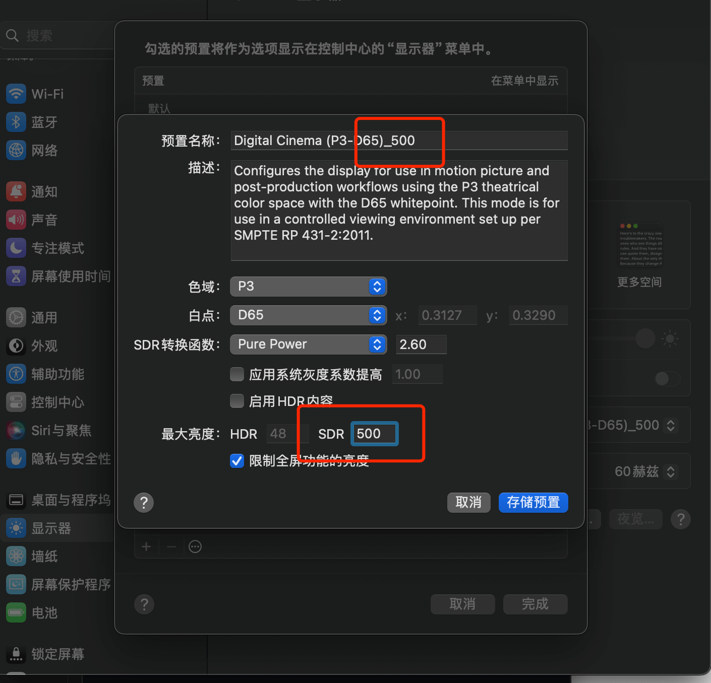
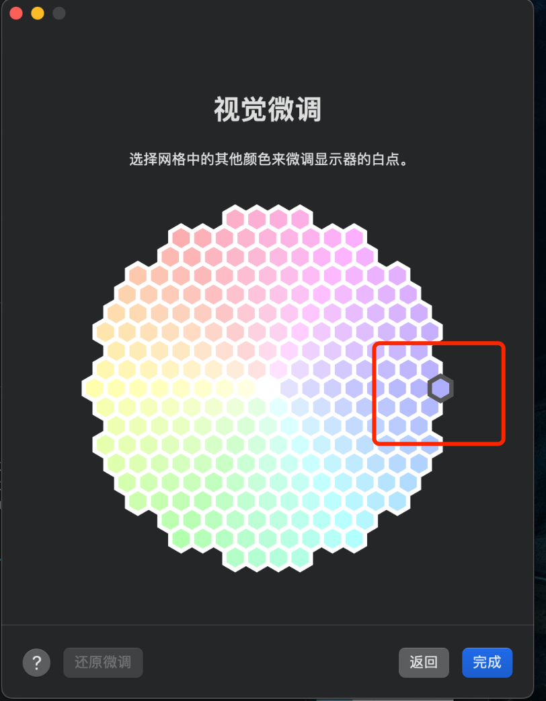
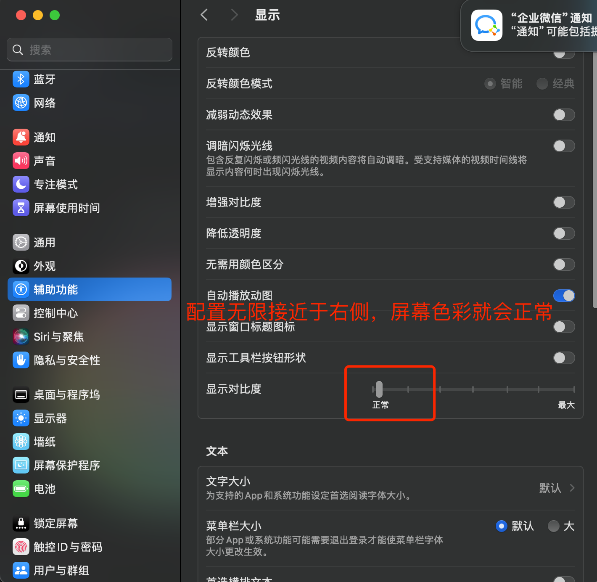
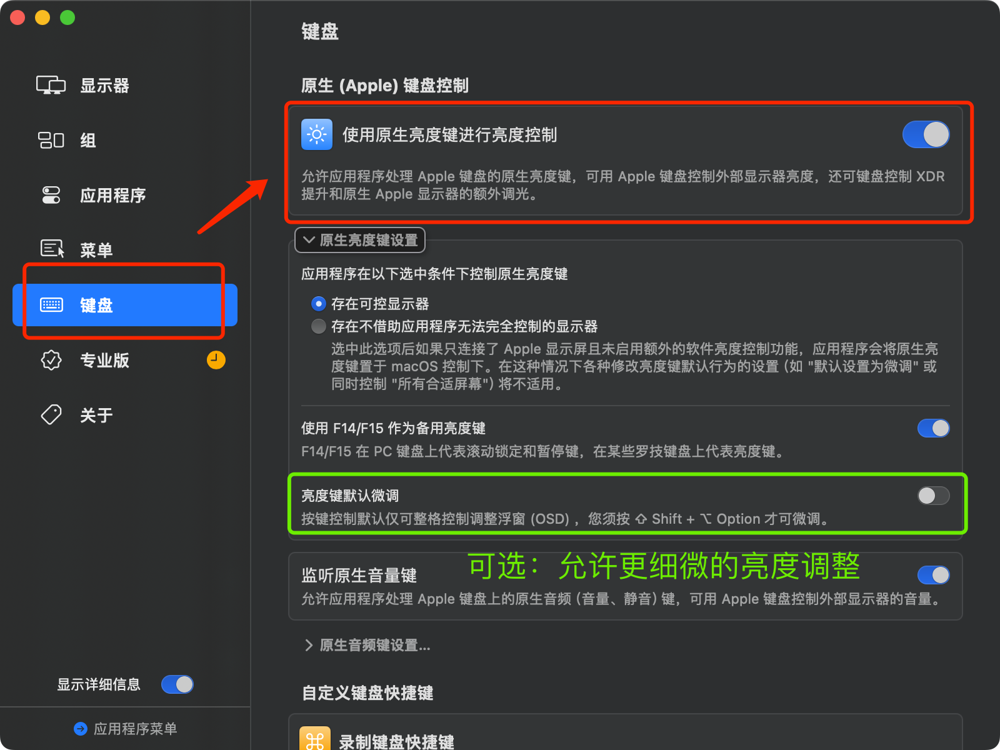

# 解决 mbp16 的 miniled 屏幕刺眼发黄问题

> 本教程用于解决 mbp16 新款 miniled 屏幕发黄、刺眼问题。

## 一、调整色域、最大亮度

进入设置页面，选择`显示器`，右侧选中`预制`，下拉列表选择`自定义预制`，点击`+`，创建一个新的色域方案（如图），之后刷新率选择 `60`（ProMotion开了会眼疲劳）。

（这一步，解决了屏幕刺眼问题。）

## 二、微调色域

上一步骤完成，再点击`自定义预制`下面的`校准显示器`，再点击`视觉微调`，重置白点（如下图所示）。 

（这一步，解决了屏幕发黄问题。）

## 三、调整对比度

进入左侧菜单`辅助功能`，选中右侧`显示`，修改`显示对比度`进度条 

> tips: 滑块越无限接近于左端，画面越明亮，黑色背景文字越清楚，看你喜欢哪种视觉了。

（这一步，解决了屏幕整体色域颜色对比不明显的问题）

## 四、支持键盘控制亮度

首先下载 [BetterDisplay](https://github.com/waydabber/BetterDisplay/releases)，然后打开软件。

按快捷键 `command ,` 打开设置页面，左侧选择 `键盘`，右侧打开`使用原生亮度键进行亮度控制`，如下图所示：

