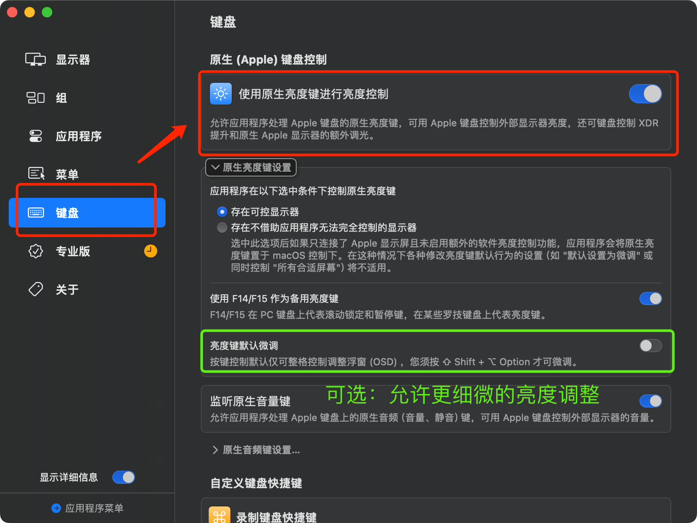
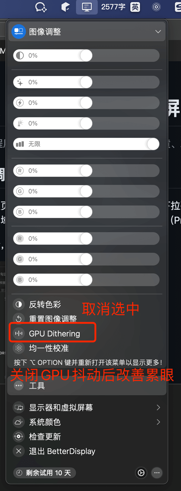

# 解决 mbp16 的 miniled 屏幕刺眼发黄问题

> 本教程用于解决 mbp16 新款 miniled 屏幕发黄、刺眼问题。

## 一、调整色域、最大亮度

进入设置页面，选择`显示器`，右侧选中`预制`，下拉列表选择`自定义预制`，点击`+`，创建一个新的色域方案（如图），之后刷新率选择 `60`（ProMotion开了会眼疲劳）。

（这一步，解决了屏幕刺眼问题。）

## 二、解决偏黄（微调色域）

上一步骤完成，再点击`自定义预制`下面的`校准显示器`，再点击`视觉微调`，重置白点（如下图所示）。 
> 可以根据喜好任意选中白点，以展示合适的色域风格，教程为中性偏冷淡。

（这一步，解决了屏幕发黄问题。）

## 三、解决屏幕发灰（微调对比度）

进入左侧菜单`辅助功能`，选中右侧`显示`，修改`显示对比度`进度条 

> tips: 滑块越无限接近于左端，画面越明亮，黑色背景文字越清楚，看你喜欢哪种视觉了。

（这一步，解决了屏幕整体色域颜色对比不明显的问题）

## 四、支持键盘控制亮度

首先下载 [BetterDisplay](https://github.com/waydabber/BetterDisplay/releases)，然后打开软件。

按快捷键 `command ,` 打开设置页面，左侧选择 `键盘`，右侧打开`使用原生亮度键进行亮度控制`，如下图所示：

## 五、解决屏幕累眼问题
打开`BetterDisplay`，选中`图像调整`，取消选中`GPU Dithering`。（可以感觉眼睛立马轻松很多）

## 六、尾记
到此为止，MBP 新款 mini-led 屏幕，调到了一个可以长时间文字工作的程度。不再过于发黄、累眼、刺眼，macbook Pro系列可以成为一个更好的选择。

## 参考资料
- [ledstrain - 禁用Apple芯片上的GPU抖动](https://ledstrain.org/d/2686-i-disabled-dithering-on-apple-silicon-introducing-stillcolor-macos-m1m2m3)
- [知乎maximus - 缓解 macbook pro 14 16 miniLED SDR 屏幕 辣眼 累眼 的办法](https://zhuanlan.zhihu.com/p/668744338)
- [GitHub issue - BetterDisplay支持GPU抖动开关](https://github.com/waydabber/BetterDisplay/issues/2766)